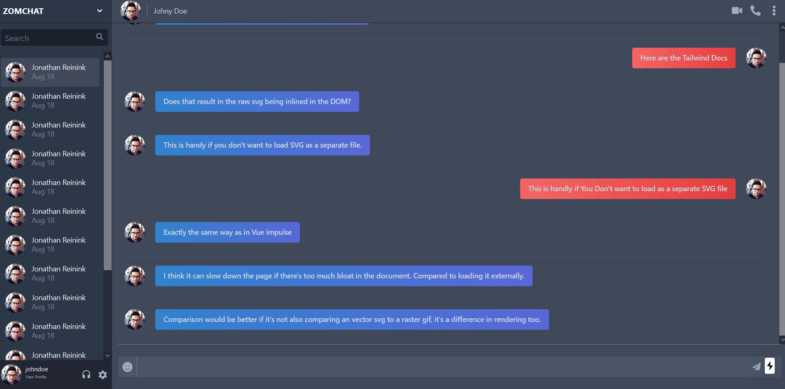
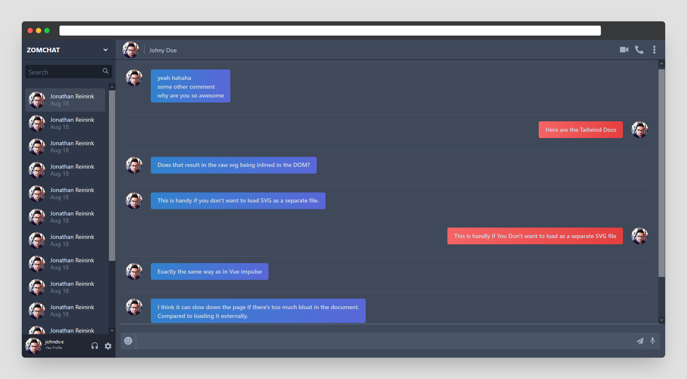

# ZomChat v2
This the new NextJs version of [ZomChat](https://github.com/anant-bahuguna/zomchat)(original) which I created for Zomentum Assessment.

## UI Demo - [ZomChat](https://zomchat-nextjs.vercel.app/)

## UI Screenshots

## Getting Started

These instructions will get you a copy of the project up and running on your local machine for development and testing purposes. See deployment for notes on how to deploy the project on a live system.

### Prerequisites

What things you need to install the software and how to install them

- [node](https://nodejs.org/en/)
- cmd/terminal
- [npm](https://www.npmjs.com/get-npm) or [yarn](https://classic.yarnpkg.com/en/docs/install#windows-stable)

### Installing

A step by step series of examples that tell you how to get a development env running

- Clone/download the project

- Inside the project directory, run the command -
  `npm install`
       OR
  `yarn install`
  
- Start the development server by running the command -
  `npm run dev` OR `yarn run dev`

- The project will be started at - [localhost:3000](http://localhost:3000/)

## Deployment

* [Live Link](https://zomchat-nextjs.vercel.app/)
* Deployed using [vercel](https://vercel.com/)
* It can be deployed on any popular sevice like vercel, netlify, heroku, github pages,etc.

## Built With

* [NextJs](https://reactjs.org/) - SSR framework for ReactJs
* [TailwindCSS](https://tailwindcss.com/) - CSS framework
* [Redux](https://redux.js.org/) - State management library

## WIP 🛠️

- Adding redux for state management

